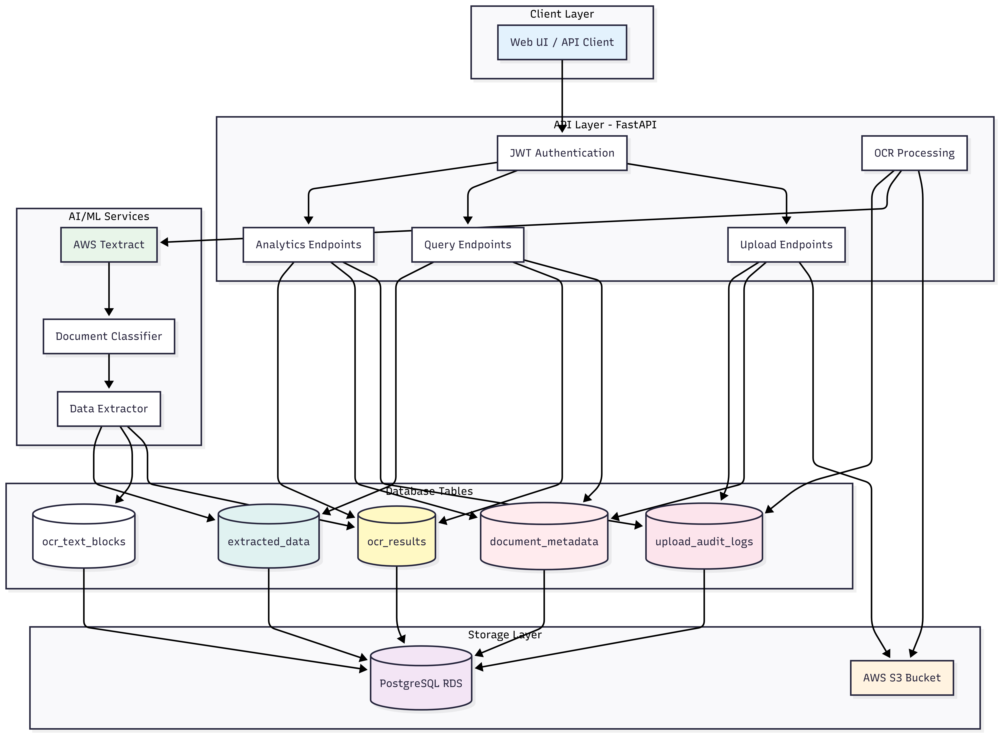
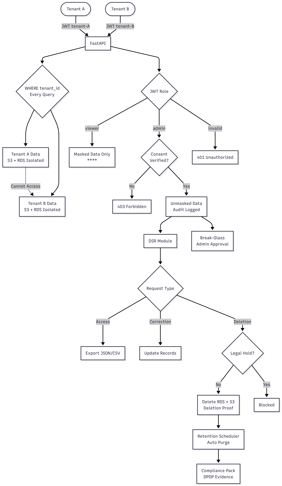
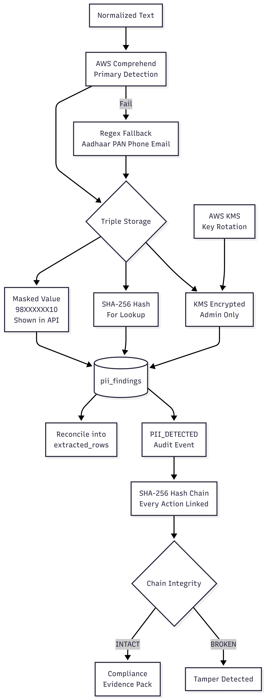
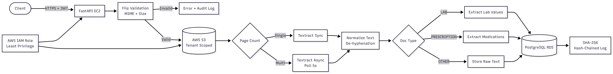
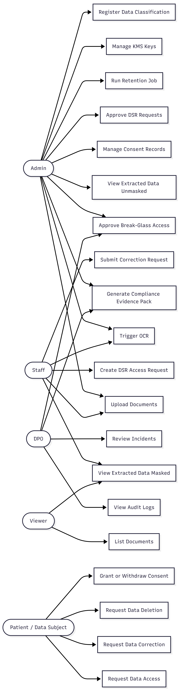

# Healthcare Document Intelligence Platform

> **Data Engineering Internship Project — DataDives**
> Role: Data Engineer Intern | Duration: January 2026 - May 2026

---

## Overview

Healthcare Document Intelligence Platform is a cloud-native, multi-tenant medical document processing platform built during my Data Engineering Internship at DataDives. The platform automates OCR extraction, PII detection, structured data storage, and full DPDP Act 2023 compliance workflows for healthcare documents such as lab reports, prescriptions, and discharge summaries.

The system processes sensitive patient data — Aadhaar numbers, phone numbers, names, clinical values — and enforces masking, KMS encryption, consent-gated access, immutable audit trails, and data subject rights across every layer.

---

## Problem Statement

Healthcare organisations process thousands of medical PDFs daily. Manual review is:
- Time-consuming and error-prone
- Unable to scale with document volume
- Lacking standardised PII protection
- Without audit trail for HIPAA / DPDPA compliance

**This platform solves all of the above through a fully automated, compliance-first pipeline.**

---

## Architecture Diagrams

### System Architecture — Complete Platform Flow

### Upload Sequence Diagram

### OCR + PII Processing — Sequence Diagram

### PII Detection + Triple Storage + Audit Chain

### RBAC + ABAC + DSR + Compliance Workflow

### Use Case Diagram — All Actors and Roles

---

## Key Features

### OCR and Document Intelligence
- AWS Textract integration — sync (single-page) and async (multi-page with polling)
- Automatic PDF repair pipeline using PyPDF2 on Textract rejection
- Document classification: `LAB_REPORT` / `PRESCRIPTION` / `OTHER`
- Text normalisation — de-hyphenation, line merging, whitespace cleanup
- Structured key-value extraction — patient name, Aadhaar, phone, lab values, medications

### PII Detection and Protection
- **Primary:** AWS Comprehend — detects NAME, PHONE, EMAIL, AADHAAR, PAN, SSN, CREDIT_CARD, ADDRESS, DATE, AGE, PASSPORT and more
- **Fallback:** Regex engine — Aadhaar pattern, PAN pattern, Indian mobile numbers, email
- **Triple storage per finding:**
  - `masked_value` — always shown in API (e.g. `98XXXXXX10`)
  - `hashed_value` — SHA-256 for lookup without raw exposure
  - `value_raw_encrypted` — AWS KMS AES-256 encrypted, admin-only decryption
- Reconciliation engine — backfills extracted rows with masked values automatically

### Security and Compliance
- JWT HS256 authentication with tenant_id, user_id, role claims
- RBAC (admin / staff / viewer) + ABAC (ownership, environment, purpose)
- Break-glass emergency access with justification and approval workflow
- Consent management — grant / withdraw / verify per user per purpose
- Immutable SHA-256 hash-chained audit logs — tamper-evident
- Data Subject Rights (DSR) — access export, field correction, document erasure
- OTP-based identity verification before DSR operations
- Legal hold — prevents deletion even during automated retention scheduler
- Retention scheduler — auto-purge past retention_days with deletion certificates
- Policy versioning — DRAFT → ACTIVE → rollback workflow
- Compliance evidence pack — downloadable JSON/CSV with chain integrity check

---

## Technology Stack

| Category | Technology |
|---|---|
| Backend Framework | FastAPI (Python) |
| Database | PostgreSQL 14 on AWS RDS |
| Cloud Compute | AWS EC2 Ubuntu 24 |
| Document Storage | AWS S3 (tenant-scoped) |
| OCR Engine | AWS Textract (Sync + Async) |
| PII Detection | AWS Comprehend + Regex fallback |
| Encryption | AWS KMS (Symmetric AES-256) |
| Authentication | JWT HS256 |
| PDF Handling | PyPDF2 |
| DB Driver | psycopg2 |
| Deployment | Uvicorn ASGI |

---

## Database Schema — 18 Tables

---

## API Surface

52 endpoints across the following functional groups:

- Document Upload and Management
- OCR Trigger and Results
- Structured Data Extraction
- PII Detection Summary
- Consent Management
- Data Subject Rights (DSR)
- Policy Management and Versioning
- Encryption Key Management
- Data Classification Registry
- Audit Logs and Statistics
- Compliance Evidence Pack
- Retention and Legal Hold
- Break-Glass Access
- Incident Response
- System Health Check

---

## DPDP Act 2023 Compliance Coverage

| DPDP Requirement | Implementation |
|---|---|
| Data Minimisation | PII masked by default in all API responses |
| Purpose Limitation | Policy engine restricts PII access by role and purpose |
| Consent Management | Grant / withdraw / verify per user per purpose |
| Right of Access | DSR access request with masked export |
| Right to Correction | Field-level correction with admin approval |
| Right to Erasure | Document deletion with legal hold check and deletion certificate |
| Retention Limits | Automated scheduler with per-tenant retention policies |
| Breach Notification | Incident records with scope, datasets, and actions taken |
| Audit Trail | SHA-256 hash-chained immutable logs |
| Encryption at Rest | AWS KMS encrypted raw PII values |

---

## What I Built During This Internship

- Provisioned complete AWS infrastructure from scratch — EC2, RDS, S3, KMS, IAM with least-privilege policies
- Designed and implemented the 18-table PostgreSQL schema with multi-tenancy, cascade deletes, and foreign key constraints
- Built the FastAPI backend by implementing all project stories
- Integrated AWS Textract with sync/async routing, PDF validation, and auto-repair pipeline
- Integrated AWS Comprehend for PII detection with Regex fallback and reconciliation engine
- Implemented SHA-256 hash-chained audit logging for tamper-evident compliance
- Built the complete DPDP compliance stack — consent, DSR, retention, policy versioning, evidence pack

---

## Disclaimer

This repository contains only architectural diagrams, project documentation, and high-level educational material produced during the internship. **No proprietary source code, company credentials, internal API implementations, database connection strings, AWS resource identifiers, or confidential business logic are included.** All diagrams and documentation are representations of work done and do not expose any internal systems or trade secrets of DataDives.

---

## Author

**P. Pushyamithra**
Data Engineering Intern — DataDives
January 2026 – May 2026
